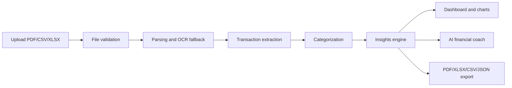

# FinanceIQ

AI-powered bank statement analyzer that converts PDF, CSV, and XLSX statements into financial insights, charts, forecasts, subscriptions, and AI chat.

FinanceIQ is a full-stack fintech portfolio project built with Next.js, TypeScript, Tailwind CSS, Framer Motion, Recharts, API routes, Zod validation, OpenAI-ready AI flows, OCR fallback, and multi-format exports.

## Live Demo

Add your deployed URL here after Vercel preview approval.

Local demo:

```bash
npm install
npm run dev
```

Open http://localhost:3000 and click **Use Sample CSV** to explore the dashboard without uploading a real statement.

## Screenshots

Screenshot placeholders for the public portfolio README:

- `public/screenshots/hero.png`
- `public/screenshots/dashboard.png`
- `public/screenshots/chatbot.png`

No screenshot files are included yet.

## Features

- Upload PDF, CSV, and XLSX bank statements.
- Analyze transactions with server-side parsing and an OpenAI-ready insight pipeline.
- OCR fallback for scanned PDFs when text extraction is limited.
- Automatic spending categorization and merchant intelligence.
- Financial health score with explainable score factors.
- Subscription hunter with annualized recurring costs and next payment estimates.
- Spending trends, category charts, merchant concentration, and weekend vs weekday comparison.
- Forecasting for next-month expenses, savings, and future balance.
- Goal planner and spending simulator.
- AI financial coach with statement-aware answers.
- Demo mode using clearly labeled synthetic data.
- Export CSV, XLSX, PDF, and JSON reports.
- Privacy-first UX with no login, no signup, and no required database.

## Tech Stack

- **Framework:** Next.js App Router
- **Language:** TypeScript
- **UI:** React, Tailwind CSS, Framer Motion, Lucide icons
- **Charts:** Recharts
- **Validation:** Zod
- **AI:** OpenAI API integration with local fallback behavior where available
- **Parsing/OCR:** PDF parsing, CSV/XLSX parsing, Tesseract OCR fallback
- **Exports:** CSV, XLSX, PDF, JSON
- **Security controls:** File validation, request schema validation, rate-limited API routes, security headers

## Architecture



## How It Works

1. The user uploads one or more bank statement files.
2. The API validates file type, size, emptiness, and request shape.
3. The backend extracts transaction-like rows from supported files.
4. FinanceIQ categorizes transactions and builds a financial report.
5. The dashboard visualizes income, expenses, categories, merchants, subscriptions, forecasts, and risks.
6. The AI coach answers questions using the active report.
7. Users can export reports in multiple formats.

## Local Setup

```bash
git clone <your-repository-url>
cd financeiq
npm install
cp .env.example .env.local
npm run dev
```

Open http://localhost:3000.

## Environment Variables

See `.env.example`.

```bash
OPENAI_API_KEY=
OPENAI_MODEL=gpt-4.1-mini
NEXT_PUBLIC_APP_URL=http://localhost:3000
NEXT_PUBLIC_SITE_NAME=FinanceIQ
NEXT_PUBLIC_ANALYTICS_ENABLED=false
```

`OPENAI_API_KEY` is optional for local UI testing, but required for real OpenAI-backed AI responses in production.

## Scripts

```bash
npm run dev      # Start local development server
npm run build    # Build production app
npm run start    # Start production server after build
npm run lint     # Run ESLint
npm run test     # Run finance engine tests
```

## API Routes

- `POST /api/analyze` - validates uploaded files and returns an `InsightReport`.
- `POST /api/chat` - answers questions using the active financial report.
- `POST /api/export` - exports report data as CSV, XLSX, PDF, or JSON.

## Security & Privacy

Implemented project-level controls:

- No login or user database required.
- Server-side file validation.
- Zod request validation.
- In-memory rate limiting for sensitive API routes.
- Security headers configured in `next.config.ts`.
- OpenAI key stays server-side.
- Uploaded statement text is treated as untrusted data in AI prompts.
- Demo data is synthetic and clearly labeled.

Important limitation: this portfolio app is not a bank-grade production system. Before serving real users, add malware scanning, persistent distributed rate limiting, full legal policy review, observability, incident response, and infrastructure-level monitoring.

## Limitations

- Parsing accuracy depends on the bank statement format.
- Complex scanned PDFs may require clearer OCR preprocessing.
- In-memory rate limiting is suitable for a single instance, not horizontally scaled production.
- No long-term storage, user accounts, or historical account sync are included.
- AI responses depend on the configured model and prompt quality.

## Future Improvements

- Bank-format-specific parsers.
- Persistent encrypted report history with explicit user consent.
- Malware scanning for uploads.
- Distributed rate limiting with Redis or a managed edge store.
- End-to-end Playwright tests for upload, demo, chat, and export flows.
- Custom OG image and real screenshots.
- More advanced anomaly detection and duplicate payment clustering.

## Resume Highlights

- Built a full-stack AI fintech app with Next.js, TypeScript, Tailwind CSS, API routes, Recharts, and Framer Motion.
- Implemented file validation, schema validation, rate-limited API routes, security headers, prompt-injection hardening, and privacy-first UX.
- Designed a responsive dashboard with financial health scoring, category analysis, subscriptions, forecasting, merchant intelligence, and AI chat.
- Added multi-format exports for CSV, XLSX, PDF, and JSON.

## Author

Add your name, portfolio URL, LinkedIn, and GitHub profile here.
